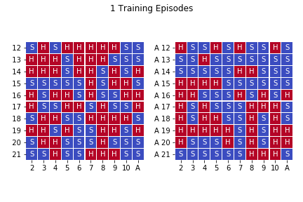
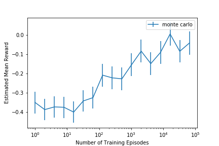
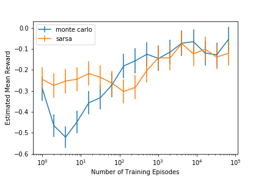
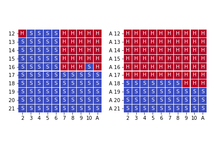

# Blackjack Reinforcement Learning

[](https://travis-ci.com/henighan/blackjack-rl)



The aim of this project is to use reinforcement learning on the game of blackjack (or at least a simplified version of blackjack).


## Usage Examples
Train and save periodic evaluation results as follows:
```python
from blackjack import learners, visualize
monte_carlo = learners.MonteCarlo(epsilon=0.1, gamma=0.9, name='monte carlo')
monte_carlo.train_and_evaluate(n_episodes=int(1e5))
fig, ax = visualize.plot_eval_reward(monte_carlo)
```



Compare Rewards of Monte Carlo and Sarsa learning
```python
from blackjack import learners, visualize
n_training_episodes = int(1e5)
monte_carlo = learners.MonteCarlo(epsilon=0.1, gamma=0.9, name='monte carlo')
sarsa = learners.Sarsa(epsilon=0.1, gamma=0.9, alpha=0.01, name='sarsa')
monte_carlo.train_and_evaluate(n_episodes=n_training_episodes)
sarsa.train_and_evaluate(n_episodes=n_training_episodes)
fig, ax = visualize.plot_eval_reward(monte_carlo, sarsa)
```



Train for a long time and visualize the strategy card
```python
monte_carlo = learners.MonteCarlo(name='monte carlo')
monte_carlo.train_and_evaluate(n_episodes=int(1e7), n_evaluate_episodes=int(1e4));
fig, ax = visualize.plot_strategy_card(monte_carlo)
fig.show()
```




Here you can read off what the optimal strategy is given your hand (on the vertical axis) and what card the dealer is showing (horizontal axis). "S" is stay, and "H" is hit. As is now obvious, this is playing a version of blackjack with only these two actions (no doubling-down, splitting, or surrender).


## Calculating the "Hand"
The list of cards held by the agent or dealer is converted into a tuple called the "hand" to reduce the state space. The first element of the tuple indicates if there is a usable ace, while the second is the numerical value.

So a hand of one king and one seven is represented as `(' ', 17)`
An ace plus a six is `('A', 17)`
If we hit on the above hand and are dealt a 5, then the ace is no longer usable. So the value of the ace drops form 11 to 1 and the new hand is `(' ', 12)`


## Pip install
```bash
pip install git+https://github.com/henighan/blackjack-rl
```

This has only been tested on python 3.6, no guarantees on other versions
